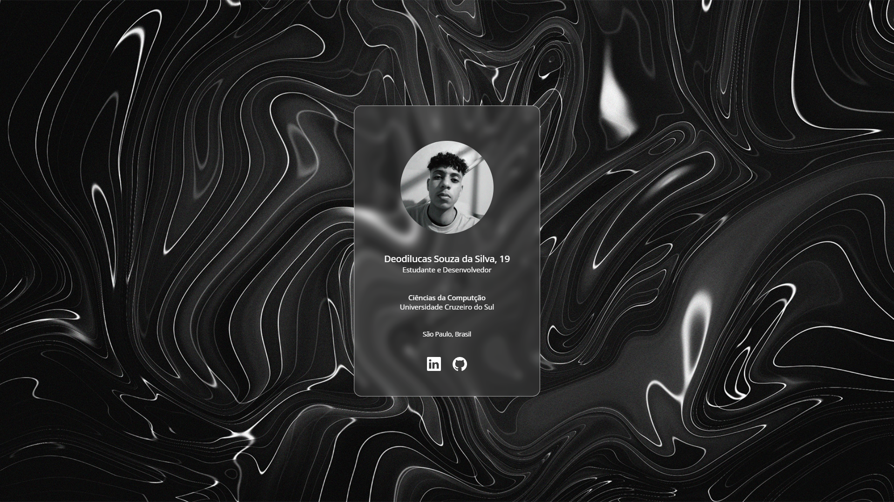

# Meu Primeiro Projeto no GitHub

Este projeto é apenas para aprendizado de git e github.

## O que é o projeto?
Card de perfil

## Linguagem utilizada
* HTML
* CSS

## O que deverá conteer no card?
* Foto de perfil
* Nome e idade
* Situação atual
* Universidade
* Redes sociais

## Resultado
 

 ## Link para acesso (https://deodilucas.github.io/Projeto-de-aprendizado-git-e-github)
 [link]([url](https://deodilucas.github.io/Projeto-de-aprendizado-git-e-github)https://deodilucas.github.io/Projeto-de-aprendizado-git-e-github){:target="_blank"}
